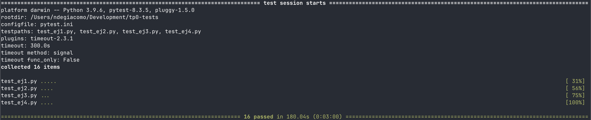
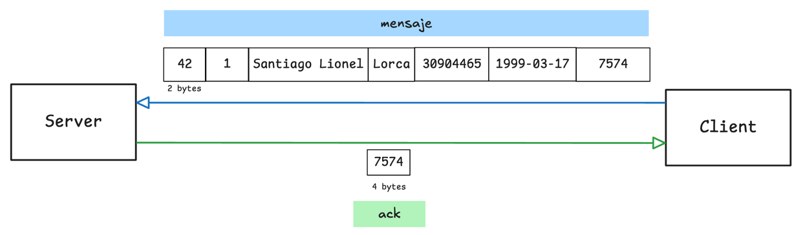
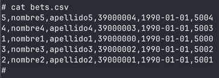
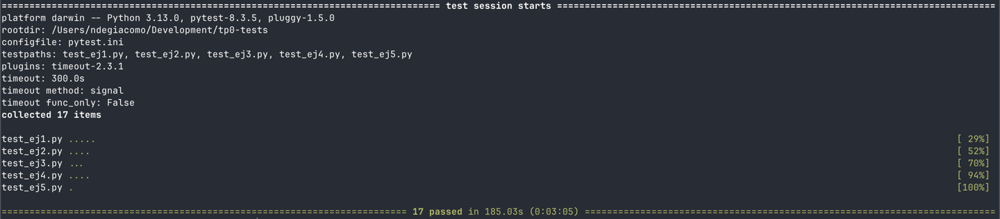
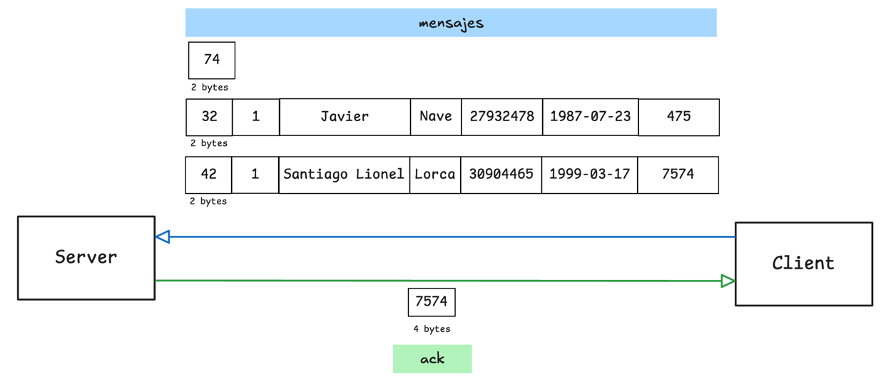
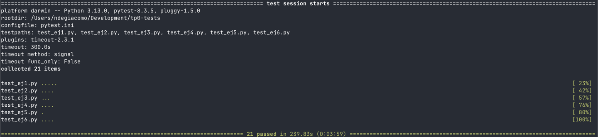
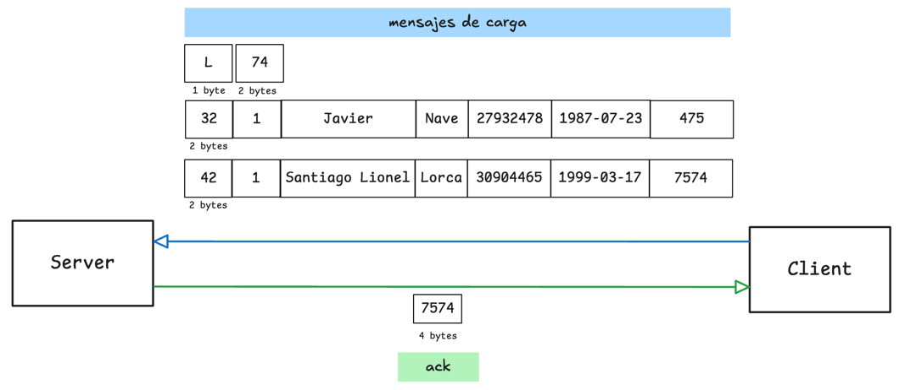
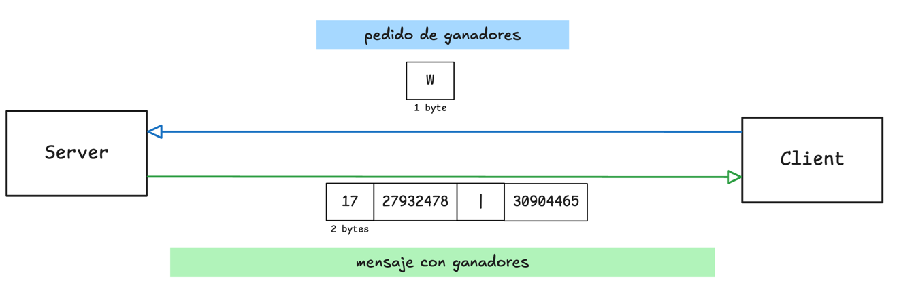
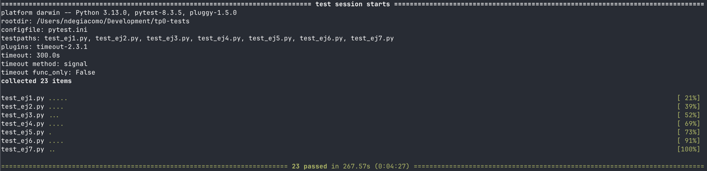
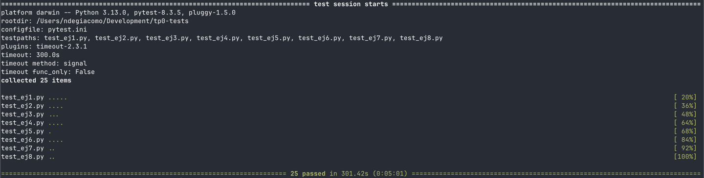

# TP0: Docker + Comunicaciones + Concurrencia

# Índice

- [Enunciado](#enunciado)
    - [Instrucciones de uso](#instrucciones-de-uso)
        - [Servidor](#servidor)
        - [Cliente](#cliente)
        - [Ejemplo](#ejemplo)
    - [Parte 1: Introducción a Docker](#parte-1-introducción-a-docker)
        - [Ejercicio N.º 1](#ejercicio-nº-1)
        - [Ejercicio N.º 2](#ejercicio-nº-2)
        - [Ejercicio N.º 3](#ejercicio-nº-3)
        - [Ejercicio N.º 4](#ejercicio-nº-4)
    - [Parte 2: Repaso de Comunicaciones](#parte-2-repaso-de-comunicaciones)
        - [Ejercicio N.º 5](#ejercicio-nº-5)
        - [Ejercicio N.º 6](#ejercicio-nº-6)
        - [Ejercicio N.º 7](#ejercicio-nº-7)
    - [Parte 3: Repaso de Concurrencia](#parte-3-repaso-de-concurrencia)
        - [Ejercicio N.º 8](#ejercicio-nº-8)
    - [Condiciones de Entrega](#condiciones-de-entrega)
- [Desarrollo](#desarrollo)
    - [Parte 1: Introducción a Docker](#parte-1-introducción-a-docker-1)
        - [Ejercicio N.º 1](#ejercicio-nº-1-1)
            - [Solución](#solución)
            - [Tests](#tests)
        - [Ejercicio N.º 2](#ejercicio-nº-2-1)
            - [Solución](#solución-1)
            - [Tests](#tests-1)
        - [Ejercicio N.º 3](#ejercicio-nº-3-1)
            - [Solución](#solución-2)
            - [Tests](#tests-2)
        - [Ejercicio N.º 4](#ejercicio-nº-4-1)
            - [Solución](#solución-3)
            - [Tests](#tests-3)
    - [Parte 2: Repaso de Comunicaciones](#parte-2-repaso-de-comunicaciones-1)
        - [Ejercicio N.º 5](#ejercicio-nº-5-1)
            - [Solución](#solución-4)
            - [Tests](#tests-4)
        - [Ejercicio N.º 6](#ejercicio-nº-6-1)
            - [Solución](#solución-5)
            - [Tests](#tests-5)
        - [Ejercicio N.º 7](#ejercicio-nº-7-1)
            - [Solución](#solución-6)
            - [Tests](#tests-6)
    - [Parte 3: Repaso de Concurrencia](#parte-3-repaso-de-concurrencia-1)
        - [Ejercicio N.º 8](#ejercicio-nº-8-1)
            - [Solución](#solución-7)
            - [Tests](#tests-7)

---

# Enunciado

En el presente repositorio se provee un esqueleto básico de cliente/servidor, en donde todas las dependencias del mismo
se encuentran encapsuladas en containers. Los alumnos deberán resolver una guía de ejercicios incrementales, teniendo en
cuenta las condiciones de entrega descritas al final de este enunciado.

El cliente (Golang) y el servidor (Python) fueron desarrollados en diferentes lenguajes simplemente para mostrar cómo
dos lenguajes de programación pueden convivir en el mismo proyecto con la ayuda de containers, en este caso
utilizando [Docker Compose](https://docs.docker.com/compose/).

## Instrucciones de uso

El repositorio cuenta con un **Makefile** que incluye distintos comandos en forma de targets. Los targets se ejecutan
mediante la invocación de: **make \<target\>**. Los targets imprescindibles para iniciar y detener el sistema son *
*docker-compose-up** y **docker-compose-down**, siendo los restantes targets de utilidad para el proceso de depuración.

Los targets disponibles son:

| target                | acción                                                                                                                                                                                                                                                                                                                                                                 |
|-----------------------|------------------------------------------------------------------------------------------------------------------------------------------------------------------------------------------------------------------------------------------------------------------------------------------------------------------------------------------------------------------------|
| `docker-compose-up`   | Inicializa el ambiente de desarrollo. Construye las imágenes del cliente y el servidor, inicializa los recursos a utilizar (volúmenes, redes, etc) e inicia los propios containers.                                                                                                                                                                                    |
| `docker-compose-down` | Ejecuta `docker-compose stop` para detener los containers asociados al compose y luego  `docker-compose down` para destruir todos los recursos asociados al proyecto que fueron inicializados. Se recomienda ejecutar este comando al finalizar cada ejecución para evitar que el disco de la máquina host se llene de versiones de desarrollo y recursos sin liberar. |
| `docker-compose-logs` | Permite ver los logs actuales del proyecto. Acompañar con `grep` para lograr ver mensajes de una aplicación específica dentro del compose.                                                                                                                                                                                                                             |
| `docker-image`        | Construye las imágenes a ser utilizadas tanto en el servidor como en el cliente. Este target es utilizado por **docker-compose-up**, por lo cual se lo puede utilizar para probar nuevos cambios en las imágenes antes de arrancar el proyecto.                                                                                                                        |
| `build`               | Compila la aplicación cliente para ejecución en el _host_ en lugar de en Docker. De este modo la compilación es mucho más veloz, pero requiere contar con todo el entorno de Golang y Python instalados en la máquina _host_.                                                                                                                                          |

### Servidor

Se trata de un "echo server", en donde los mensajes recibidos por el cliente se responden inmediatamente y sin alterar.

Se ejecutan en bucle las siguientes etapas:

1. Servidor acepta una nueva conexión.
2. Servidor recibe mensaje del cliente y procede a responder el mismo.
3. Servidor desconecta al cliente.
4. Servidor retorna al paso 1.

### Cliente

Se conecta reiteradas veces al servidor y envía mensajes de la siguiente forma:

1. Cliente se conecta al servidor.
2. Cliente genera mensaje incremental.
3. Cliente envía mensaje al servidor y espera mensaje de respuesta.
4. Servidor responde al mensaje.
5. Servidor desconecta al cliente.
6. Cliente verifica si aún debe enviar un mensaje y si es así, vuelve al paso 2.

### Ejemplo

Al ejecutar el comando `make docker-compose-up`  y luego  `make docker-compose-logs`, se observan los siguientes logs:

```
client1  | 2024-08-21 22:11:15 INFO     action: config | result: success | client_id: 1 | server_address: server:12345 | loop_amount: 5 | loop_period: 5s | log_level: DEBUG
client1  | 2024-08-21 22:11:15 INFO     action: receive_message | result: success | client_id: 1 | msg: [CLIENT 1] Message N°1
server   | 2024-08-21 22:11:14 DEBUG    action: config | result: success | port: 12345 | listen_backlog: 5 | logging_level: DEBUG
server   | 2024-08-21 22:11:14 INFO     action: accept_connections | result: in_progress
server   | 2024-08-21 22:11:15 INFO     action: accept_connections | result: success | ip: 172.25.125.3
server   | 2024-08-21 22:11:15 INFO     action: receive_message | result: success | ip: 172.25.125.3 | msg: [CLIENT 1] Message N°1
server   | 2024-08-21 22:11:15 INFO     action: accept_connections | result: in_progress
server   | 2024-08-21 22:11:20 INFO     action: accept_connections | result: success | ip: 172.25.125.3
server   | 2024-08-21 22:11:20 INFO     action: receive_message | result: success | ip: 172.25.125.3 | msg: [CLIENT 1] Message N°2
server   | 2024-08-21 22:11:20 INFO     action: accept_connections | result: in_progress
client1  | 2024-08-21 22:11:20 INFO     action: receive_message | result: success | client_id: 1 | msg: [CLIENT 1] Message N°2
server   | 2024-08-21 22:11:25 INFO     action: accept_connections | result: success | ip: 172.25.125.3
server   | 2024-08-21 22:11:25 INFO     action: receive_message | result: success | ip: 172.25.125.3 | msg: [CLIENT 1] Message N°3
client1  | 2024-08-21 22:11:25 INFO     action: receive_message | result: success | client_id: 1 | msg: [CLIENT 1] Message N°3
server   | 2024-08-21 22:11:25 INFO     action: accept_connections | result: in_progress
server   | 2024-08-21 22:11:30 INFO     action: accept_connections | result: success | ip: 172.25.125.3
server   | 2024-08-21 22:11:30 INFO     action: receive_message | result: success | ip: 172.25.125.3 | msg: [CLIENT 1] Message N°4
server   | 2024-08-21 22:11:30 INFO     action: accept_connections | result: in_progress
client1  | 2024-08-21 22:11:30 INFO     action: receive_message | result: success | client_id: 1 | msg: [CLIENT 1] Message N°4
server   | 2024-08-21 22:11:35 INFO     action: accept_connections | result: success | ip: 172.25.125.3
server   | 2024-08-21 22:11:35 INFO     action: receive_message | result: success | ip: 172.25.125.3 | msg: [CLIENT 1] Message N°5
client1  | 2024-08-21 22:11:35 INFO     action: receive_message | result: success | client_id: 1 | msg: [CLIENT 1] Message N°5
server   | 2024-08-21 22:11:35 INFO     action: accept_connections | result: in_progress
client1  | 2024-08-21 22:11:40 INFO     action: loop_finished | result: success | client_id: 1
client1 exited with code 0
```

## Parte 1: Introducción a Docker

En esta primera parte del trabajo práctico se plantean una serie de ejercicios que sirven para introducir las
herramientas básicas de Docker que se utilizarán a lo largo de la materia. El entendimiento de las mismas será crucial
para el desarrollo de los próximos TP.

### Ejercicio N.º 1:

Definir un script de bash `generar-compose.sh` que permita crear una definición de Docker Compose con una cantidad
configurable de clientes. El nombre de los containers deberá seguir el formato propuesto: client1, client2, client3,
etc.

El script deberá ubicarse en la raíz del proyecto y recibirá por parámetro el nombre del archivo de salida y la cantidad
de clientes esperados:

`./generar-compose.sh docker-compose-dev.yaml 5`

Considerar que en el contenido del script pueden invocar un subscript de Go o Python:

```
#!/bin/bash
echo "Nombre del archivo de salida: $1"
echo "Cantidad de clientes: $2"
python3 mi-generador.py $1 $2
```

En el archivo de Docker Compose de salida se pueden definir volúmenes, variables de entorno y redes con libertad, pero
recordar actualizar este script cuando se modifiquen tales definiciones en los sucesivos ejercicios.

### Ejercicio N.º 2:

Modificar el cliente y el servidor para lograr que realizar cambios en el archivo de configuración no requiera
reconstruír las imágenes de Docker para que los mismos sean efectivos. La configuración a través del archivo
correspondiente (`config.ini` y `config.yaml`, dependiendo de la aplicación) debe ser inyectada en el container y
persistida por fuera de la imagen (hint: `docker volumes`).

### Ejercicio N.º 3:

Crear un script de bash `validar-echo-server.sh` que permita verificar el correcto funcionamiento del servidor
utilizando el comando `netcat` para interactuar con el mismo. Dado que el servidor es un echo server, se debe enviar un
mensaje al servidor y esperar recibir el mismo mensaje enviado.

En caso de que la validación sea exitosa imprimir: `action: test_echo_server | result: success`, de lo contrario
imprimir:`action: test_echo_server | result: fail`.

El script deberá ubicarse en la raíz del proyecto. Netcat no debe ser instalado en la máquina _host_ y no se pueden
exponer puertos del servidor para realizar la comunicación (hint: `docker network`). `

### Ejercicio N.º 4:

Modificar servidor y cliente para que ambos sistemas terminen de forma _graceful_ al recibir la signal SIGTERM. Terminar
la aplicación de forma _graceful_ implica que todos los _file descriptors_ (entre los que se encuentran archivos,
sockets, threads y procesos) deben cerrarse correctamente antes que el thread de la aplicación principal muera. Loguear
mensajes en el cierre de cada recurso (hint: Verificar que hace el flag `-t` utilizado en el comando
`docker compose down`).

## Parte 2: Repaso de Comunicaciones

Las secciones de repaso del trabajo práctico plantean un caso de uso denominado **Lotería Nacional**. Para la resolución
de las mismas deberá utilizarse como base el código fuente provisto en la primera parte, con las modificaciones
agregadas en el ejercicio 4.

### Ejercicio N.º 5:

Modificar la lógica de negocio tanto de los clientes como del servidor para nuestro nuevo caso de uso.

#### Cliente

Emulará a una _agencia de quiniela_ que participa del proyecto. Existen 5 agencias. Deberán recibir como variables de
entorno los campos que representan la apuesta de una persona: nombre, apellido, DNI, nacimiento, número apostado (en
adelante 'número'). Ej.: `NOMBRE=Santiago Lionel`, `APELLIDO=Lorca`, `DOCUMENTO=30904465`, `NACIMIENTO=1999-03-17` y
`NUMERO=7574` respectivamente.

Los campos deben enviarse al servidor para dejar registro de la apuesta. Al recibir la confirmación del servidor se debe
imprimir por log: `action: apuesta_enviada | result: success | dni: ${DNI} | numero: ${NUMERO}`.

#### Servidor

Emulará a la _central de Lotería Nacional_. Deberá recibir los campos de la cada apuesta desde los clientes y almacenar
la información mediante la función `store_bet(...)` para control futuro de ganadores. La función `store_bet(...)` es
provista por la cátedra y no podrá ser modificada por el alumno.
Al persistir se debe imprimir por log: `action: apuesta_almacenada | result: success | dni: ${DNI} | numero: ${NUMERO}`.

#### Comunicación:

Se deberá implementar un módulo de comunicación entre el cliente y el servidor donde se maneje el envío y la recepción
de los paquetes, el cual se espera que contemple:

* Definición de un protocolo para el envío de los mensajes.
* Serialización de los datos.
* Correcta separación de responsabilidades entre modelo de dominio y capa de comunicación.
* Correcto empleo de sockets, incluyendo manejo de errores y evitando los fenómenos conocidos como [_short read y short
  write_](https://cs61.seas.harvard.edu/site/2018/FileDescriptors/).

### Ejercicio N.º 6:

Modificar los clientes para que envíen varias apuestas a la vez (modalidad conocida como procesamiento por _chunks_ o
_batches_).
Los _batches_ permiten que el cliente registre varias apuestas en una misma consulta, acortando tiempos de transmisión y
procesamiento.

La información de cada agencia será simulada por la ingesta de su archivo numerado correspondiente, provisto por la
cátedra dentro de `.data/datasets.zip`.
Los archivos deberán ser inyectados en los containers correspondientes y persistido por fuera de la imagen (hint:
`docker volumes`), manteniendo la convención de que el cliente N utilizara el archivo de apuestas
`.data/agency-{N}.csv` .

En el servidor, si todas las apuestas del *batch* fueron procesadas correctamente, imprimir por log:
`action: apuesta_recibida | result: success | cantidad: ${CANTIDAD_DE_APUESTAS}`. En caso de detectar un error con
alguna de las apuestas, debe responder con un código de error a elección e imprimir:
`action: apuesta_recibida | result: fail | cantidad: ${CANTIDAD_DE_APUESTAS}`.

La cantidad máxima de apuestas dentro de cada _batch_ debe ser configurable desde config.yaml. Respetar la clave
`batch: maxAmount`, pero modificar el valor por defecto de modo tal que los paquetes no excedan los 8kB.

Por su parte, el servidor deberá responder con éxito solamente si todas las apuestas del _batch_ fueron procesadas
correctamente.

### Ejercicio N.º 7:

Modificar los clientes para que notifiquen al servidor al finalizar con el envío de todas las apuestas y así proceder
con el sorteo.
Inmediatamente después de la notificación, los clientes consultarán la lista de ganadores del sorteo correspondientes a
su agencia.
Una vez el cliente obtenga los resultados, deberá imprimir por log:
`action: consulta_ganadores | result: success | cant_ganadores: ${CANT}`.

El servidor deberá esperar la notificación de las 5 agencias para considerar que se realizó el sorteo e imprimir por
log: `action: sorteo | result: success`.
Luego de este evento, podrá verificar cada apuesta con las funciones `load_bets(...)` y `has_won(...)` y retornar los
DNI de los ganadores de la agencia en cuestión. Antes del sorteo no se podrán responder consultas por la lista de
ganadores con información parcial.

Las funciones `load_bets(...)` y `has_won(...)` son provistas por la cátedra y no podrán ser modificadas por el alumno.

No es correcto realizar un broadcast de todos los ganadores hacia todas las agencias, se espera que se informen los DNI
ganadores que correspondan a cada una de ellas.

## Parte 3: Repaso de Concurrencia

En este ejercicio es importante considerar los mecanismos de sincronización a utilizar para el correcto funcionamiento
de la persistencia.

### Ejercicio N.º 8:

Modificar el servidor para que permita aceptar conexiones y procesar mensajes en paralelo. En caso de que el alumno
implemente el servidor en Python utilizando _multithreading_, deberán tenerse en cuenta
las [limitaciones propias del lenguaje](https://wiki.python.org/moin/GlobalInterpreterLock).

## Condiciones de Entrega

Se espera que los alumnos realicen un _fork_ del presente repositorio para el desarrollo de los ejercicios y que
aprovechen el esqueleto provisto tanto (o tan poco) como consideren necesario.

Cada ejercicio deberá resolverse en una rama independiente con nombres siguiendo el formato `ej${Nro de ejercicio}`. Se
permite agregar commits en cualquier órden, así como crear una rama a partir de otra, pero al momento de la entrega
deberán existir 8 ramas llamadas: ej1, ej2, ..., ej7, ej8.
(hint: verificar listado de ramas y últimos commits con `git ls-remote`)

Se espera que se redacte una sección del README en donde se indique cómo ejecutar cada ejercicio y se detallen los
aspectos más importantes de la solución provista, como ser el protocolo de comunicación implementado (Parte 2) y los
mecanismos de sincronización utilizados (Parte 3).

Se proveen [pruebas automáticas](https://github.com/7574-sistemas-distribuidos/tp0-tests) de caja negra. Se exige que la
resolución de los ejercicios pase tales pruebas, o en su defecto que las discrepancias sean justificadas y discutidas
con los docentes antes del día de la entrega. El incumplimiento de las pruebas es condición de desaprobación, pero su
cumplimiento no es suficiente para la aprobación. Respetar las entradas de log planteadas en los ejercicios, pues son
las que se chequean en cada uno de los tests.

La corrección personal tendrá en cuenta la calidad del código entregado y casos de error posibles, se manifiesten o no
durante la ejecución del trabajo práctico. Se pide a los alumnos leer atentamente y **tener en cuenta** los criterios de
corrección informados [en el campus](https://campusgrado.fi.uba.ar/mod/page/view.php?id=73393).


---

# Desarrollo

## Parte 1: Introducción a Docker

### Ejercicio N.º 1:

#### Solución

Para la solución se utiliza un script the Python y la biblioteca [Jinja](https://jinja.palletsprojects.com/en/stable/).
La plantilla se encuentra en `templates/docker-compose-dev.yaml.jinja`

En este momento se decide utilizar la menor cantidad de variables posible en la plantilla, sabiendo que en los
siguientes ejercicios se pueden ir agregando las nuevas variables a medida que se necesiten.

Se puede utilizar el generador de la siguiente manera:

```
./generar-compose.sh <output_file> <n_clients>
```

#### Tests


### Ejercicio N.º 2:

#### Solución

Se realizaron los siguientes cambios.

- Se modifica la plantilla utilizada para generar el yaml para el _docker compose_ (
  `templates/docker-compose-dev.yaml.jinja`).
    - Se agregan _docker volumes_ de tipo [Bind Mounts](https://docs.docker.com/engine/storage/bind-mounts/).
    - Se remueve, del environment, la configuración del nivel de logs.
- Se modifica el _client Dockerfile_, eliminando el `COPY` del archivo de configuración.
- Se modifica el Makefile, removiendo el `flag --build` de `docker-compose-up` para no forzar el _rebuild_ de las
  imágenes.

#### Tests


### Ejercicio N.º 3:

#### Solución

Ya se dispone de un network configurado en el yaml del docker compose. Este network se llama "tp0_testing_net". Se
puede verificar con el comando `docker network ls`.

Para no utilizar Netcat dentro del host, se busca por ejecutar la prueba en un contenedor temporal basado en la imagen
de [busybox](https://hub.docker.com/_/busybox).

La validación del servidor puede realizarse de la siguiente manera.

```bash
docker run --rm --network="tp0_testing_net" busybox sh -c "echo 'custom message' | nc server 12345"
```

Este comando envía un mensaje al puerto 12345 del servidor.

Para automatizar esta validación, se crea el archivo `validar-echo-server.sh` que ejecuta dicho comando y verifica que
se reciba la respuesta adecuada.

#### Tests


### Ejercicio N.º 4:

#### Solución

En el servidor, se realizan las siguientes modificaciones.

- Se agregan métodos `__enter__` y `__exit__` en el objeto Server para manejar la creación y destrucción.
- Desde el main se usa el objeto Server en un bloque `with`.
- Se utiliza un handler para la señal SIGTERM que, mediante un flag, interrumpe el bucle principal.
- Se agrega un timeout para que la llamada a `accept()` no sea bloqueante indefinidamente.
    - Cerrar el socket no es suficiente para interrumpir `accept()`.
    - Este timeout debería que ser menor al tiempo de espera de `docker compose stop`.

En el cliente, se realizan las siguientes modificaciones.

- Se agrega el handler para la señal SIGTERM en la función NewClient que construye el objeto Client.
- Se utiliza un flag para detener el bucle principal del cliente.

#### Tests



## Parte 2: Repaso de Comunicaciones

### Ejercicio N.º 5:

#### Solución

Se implementó la comunicación entre cliente y servidor para registrar apuestas.

El protocolo de comunicación es el siguiente:

1. El cliente envía un mensaje con el siguiente formato. Comienza con un número de 2 bytes que indica el largo del
   mensaje y continúa con los valores de la apuesta separados por un delimitador `|`.
    ```
    <largo mensaje><id agencia>|<nombre>|<apellido>|<documento>|<nacimiento>|<numero>
    ```
2. El servidor parsea el mensaje, registra la apuesta y responde un ACK (un entero) con el número de la apuesta.
    ```
    <numero>
    ```
3. Luego, el cliente recibe el ACK y cierra la conexión.



Por el momento, no se cuenta con una política de retries, y cada cliente realiza un único intento de comunicación. Se
entiende que una política de reintentos podría ser implementada en futuras iteraciones.

Como extra, se modifica la plantilla del `docker compose` para que se autogeneren las diferentes apuestas que
transmiten los clientes.



#### Tests



### Ejercicio N.º 6:

#### Solución

El protocolo de comunicación sufrió las siguientes modificaciones.

- Al comienzo de un batch de mensajes se envía la cantidad total de bytes del batch.
- Si esa cantidad es cero, significa que no hay más apuestas para enviar.
- El ACK por cada batch corresponde al último número de apuesta del batch.



Estimación del Max Batch Size por defecto.

Se cuenta con el siguiente formato de mensaje:

```
<largo mensaje><id agencia>|<nombre>|<apellido>|<documento>|<nacimiento>|<numero>
```

Estimemos un tamaño aproximado para cada campo.

- `largo mensaje`: 2 bytes (valor fijo)
- `id agencia`: 4 bytes (valor fijo)
- `nombre`: 50 bytes
- `apellido`: 50 bytes
- `documento`: 4 bytes (valor fijo)
- `nacimiento`: 10 bytes (valor fijo)
- `numero`: 4 bytes (valor fijo)

Por lo tanto, el tamaño total del mensaje es de 124 bytes, a lo que se suman 5 bytes de los delimitadores `|`. Dando un
total de 129 bytes.

Si se considera un tamaño máximo de 8kB (8192 bytes) para el batch de mensajes, se puede estimar el Max Batch Size como:
`8192 bytes / 129 bytes = 63 mensajes (apuestas)`.

#### Tests



### Ejercicio N.º 7:

#### Solución

La comunicación del final de carga por parte de los clientes ya fue implementada en el punto anterior. Para este punto,
se modifica levemente el servidor para que entienda si finalizó la carga de todos los clientes que se esperan.

Se modificó ligeramente el protocolo de comunicación para distinguir entre dos tipos de mensajes.

- Si el mensaje comienza con `L`, indica que es un mensaje de carga.
- Si el mensaje comienza con `W`, indica que es un mensaje de control de ganadores.



El protocolo para la comunicación de los ganadores (mensaje enviado por el servidor) es el siguiente.

```
<largo mensaje><documento 1>|<documento 2>|<documento 3>
```



No se implementa un ACK para el control de ganadores, ya que el cliente se encarga de intentar (con una cantidad de
reintentos definida) hasta obtener la respuesta. El servidor simplemente ignora el mensaje si aún no se pueden conocer
los ganadores.

#### Tests



## Parte 3: Repaso de Concurrencia

### Ejercicio N.º 8:

#### Solución

Para la implementación del procesado de los mensajes en paralelo, se utiliza la biblioteca estándar de Python:
multiprocessing. Esta nos permite crear procesos y ejecutarlos en paralelo, entre otras cosas. Hacemos uso de las
siguientes herramientas.

- `multiprocessing.Lock`. Se utiliza para sincronizar la lectura y escritura del archivo _bets.csv_.
- `multiprocessing.Manager`. Se utiliza para los diccionarios concurrentes que permiten la sincronización de los
  procesos. Por ejemplo, para saber cuando todos los clientes terminaron de enviar sus apuestas.
- `multiprocessing.Process`. Se utiliza para crear los procesos.
- `multiprocessing.Event`. Se utiliza para sincronizar cuando se terminó de realizar el cálculo de los ganadores y el
  servidor está listo para responder consultas.

#### Tests


