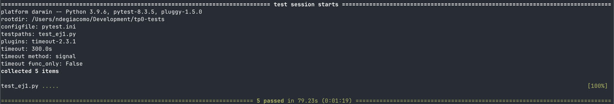
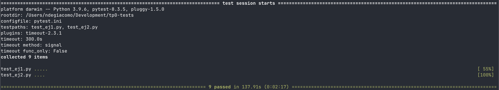
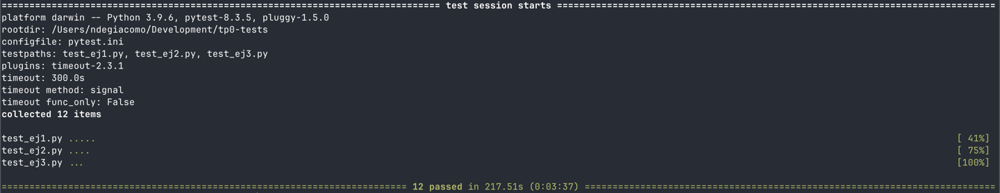

# TP0: Docker + Comunicaciones + Concurrencia

## Parte 1: Introducción a Docker

### Ejercicio N.º 1:

#### Solución

Para la solución se utiliza un script the Python y la biblioteca [Jinja](https://jinja.palletsprojects.com/en/stable/).
La plantilla se encuentra en `templates/docker-compose-dev.yaml.jinja`

En este momento se decide utilizar la menor cantidad de variables posible en la plantilla, sabiendo que en los
siguientes ejercicios se pueden ir agregando las nuevas variables a medida que se necesiten.

Se puede utilizar el generador de la siguiente manera:

```
./generar-compose.sh <output_file> <n_clients>
```

#### Tests



### Ejercicio N.º 2:

#### Solución

Se realizaron los siguientes cambios.

- Se modifica la plantilla utilizada para generar el yaml para el _docker compose_ (
  `templates/docker-compose-dev.yaml.jinja`).
    - Se agregan _docker volumes_ de tipo [Bind Mounts](https://docs.docker.com/engine/storage/bind-mounts/).
    - Se remueve, del environment, la configuración del nivel de logs.
- Se modifica el _client Dockerfile_, eliminando el `COPY` del archivo de configuración.
- Se modifica el Makefile, removiendo el `flag --build` de `docker-compose-up` para no forzar el _rebuild_ de las
  imágenes.

#### Tests



### Ejercicio N.º 3:

#### Solución

Ya se dispone de un network configurado en el yaml del docker compose. Este network se llama "tp0_testing_net". Se
puede verificar con el comando `docker network ls`.

Para no utilizar Netcat dentro del host, se busca por ejecutar la prueba en un contenedor temporal basado en la imagen
de [busybox](https://hub.docker.com/_/busybox).

La validación del servidor puede realizarse de la siguiente manera.

```bash
docker run --rm --network="tp0_testing_net" busybox sh -c "echo 'custom message' | nc server 12345"
```

Este comando envìa un mensaje al puerto 12345 del servidor.

Para automatizar esta validación, se crea el archivo `validar-echo-server.sh` que ejecuta dicho comando y verifica que
se reciba la respuesta adecuada.

#### Tests



### Ejercicio N.º 4:

#### Solución

En el server y en el client se agrega una función para manejar la finalización del proceso cuando se recibe una señal
SIGTERM

En el server se liberan los siguientes recursos.
- Server Socket
- Client Socket

En el client se liberan los siguientes recursos.
- Socket

#### Tests

...
